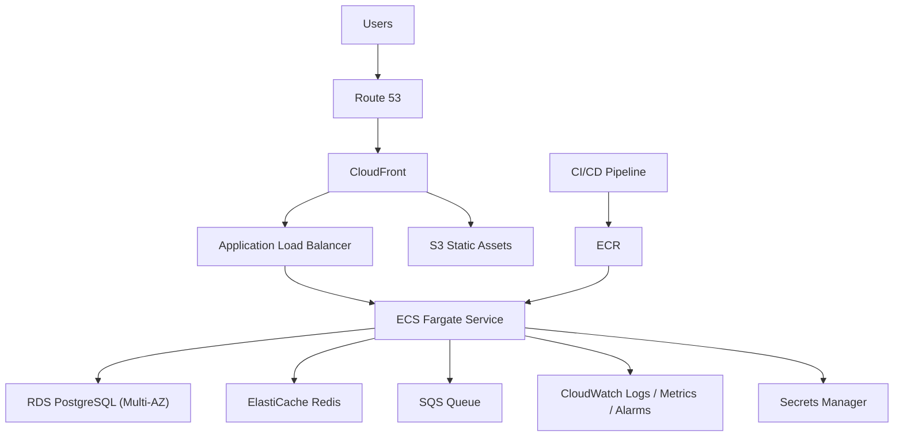

# Problem 2

I treated this as an AWS architecture design question for a production web application.

The goal here is:

- simple enough to explain in an interview
- realistic for a small or medium engineering team
- stable and secure without overengineering
- easy to scale later

## Architecture diagram

## Components

### Route 53

- manages the application DNS
- points the domain to CloudFront
- simple and standard choice on AWS

### CloudFront

- caches static content closer to users
- reduces load on the backend
- can also sit in front of the ALB for better global performance

### S3

- stores static assets like images, frontend bundles, and downloadable files
- cheap and durable
- works well with CloudFront

### Application Load Balancer

- entry point for HTTP and HTTPS traffic
- routes requests to ECS tasks
- provides health checks

### ECS Fargate

- runs the application containers
- easier to operate than managing EC2 instances or jumping directly to EKS
- good fit for a lean team

### RDS PostgreSQL

- primary relational database
- Multi-AZ gives better availability
- automated backups reduce operational risk

### ElastiCache Redis

- used for caching, session storage, rate limiting, or short-lived data
- helps reduce database pressure

### SQS

- handles background jobs asynchronously
- useful for email sending, report generation, webhook retries, and similar tasks
- helps protect the main app during traffic spikes

### Secrets Manager

- stores database passwords, API keys, and other sensitive values
- better than putting secrets directly into task definitions or env files

### CloudWatch

- central place for logs, metrics, and alarms
- enough for a practical first version of observability

### ECR + CI/CD

- container images are built in CI and pushed to ECR
- ECS deploys new versions from there
- keeps deployments repeatable and straightforward

## Networking layout

- public subnets:
  - ALB
  - NAT Gateway
- private app subnets:
  - ECS tasks
- private data subnets:
  - RDS
  - Redis

This keeps the application and databases off the public internet while still allowing outbound access where needed.

## Request flow

1. user requests the application domain
2. Route 53 resolves to CloudFront
3. CloudFront serves static content from S3 when possible
4. dynamic requests go to the ALB
5. ALB forwards traffic to ECS tasks
6. ECS reads and writes data through RDS and Redis
7. long-running work is pushed to SQS

## Why I chose this setup

- common AWS pattern, easy to explain
- managed services reduce ops overhead
- enough separation between web, app, and data layers
- can scale without redesigning everything

## Scaling plan

### Phase 1: small production setup

- 2 ECS tasks across 2 AZs
- 1 ALB
- RDS PostgreSQL with Multi-AZ
- 1 Redis node
- CloudFront + S3 for static assets

This is enough for a normal startup workload.

### Phase 2: moderate growth

- enable ECS autoscaling based on CPU and memory
- add scaling based on ALB request count
- increase Redis node size
- tune database indexes and connection pooling
- move background jobs fully to SQS + worker service

This should handle growing traffic without changing the architecture.

### Phase 3: larger scale

- split the application into separate services if one part becomes a bottleneck
- add read replicas for PostgreSQL if reads become heavy
- introduce Aurora PostgreSQL if operational needs grow
- use multiple ECS services behind the same ALB
- add WAF and stricter security controls

This is where the platform becomes more service-oriented, but still stays inside a familiar AWS model.

## Monitoring and alerts

- ALB `5xx` errors
- ECS task restart count
- ECS CPU and memory saturation
- RDS CPU, storage, and connection count
- Redis memory usage and evictions
- SQS queue depth and age of oldest message

## Risks and tradeoffs

- ECS is simpler than EKS, but less flexible for very custom platform needs
- RDS vertical scaling has limits, so heavy scale may need read replicas or Aurora
- CloudFront in front of dynamic traffic adds another layer to debug

For an interview challenge, I would choose this design because it is practical, scalable, and not trying too hard to be “perfect”.
